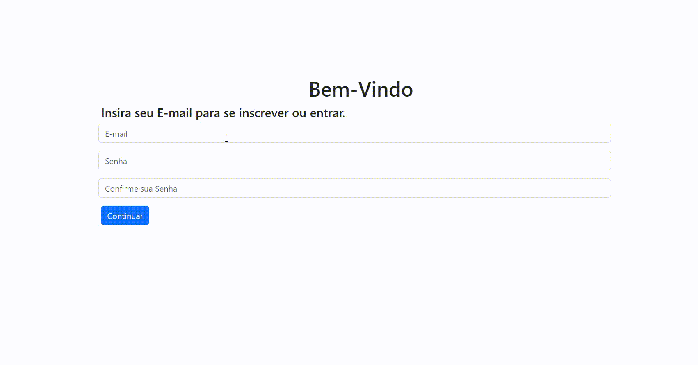

# Formulário de Cadastro Ecommerce 

  
>*Formulário de cadastro responsível, criado para aprendizado com o objetivo de simular um E-commerce.*

## Tecnologias
* ✅`` CSS 3 - Personalização``
* ✅``Html 5 - Linguagem``
* ✅``Bootstrap - Framework(CSS)``
* ✅``GitHub/Git Bash - Plataforma/Comandos``
* ✅``VSCode - Editor de Código``
#

| Referências |
| --- |
| [Nike](https://www.nike.com.br/) - Design |
| [Centauro](https://www.centauro.com.br/) - Dados requesitados |

## Nike
> [!NOTE]  
> Foi usado como referência o cadastro em duas etapas que encontra-se no próprio.

## Centauro
> [!NOTE]  
> Utilizou-se os seguindes dados (CEP, CPF, número fixo e pessoal, E-mail, estado) como refêrencia, encontrado no mesmo.
#

> [!IMPORTANT]  
> As referências foram pesquisadas anteriormente em aula.

## Desenvolvedor
 
|   <a href="https://github.com/ESChrystian">Chrystian Almeida Silva</a> |
| --- |

